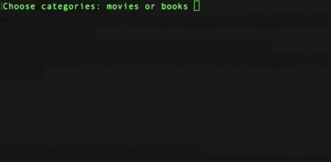
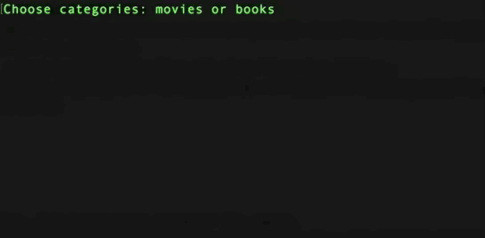

# Shrugman

Lasst uns ein weiteres Ratespiel bauen.
Ein Spieler denkt sich ein geheimes Wort oder einen Satz aus (wir verwenden Filmtitel), während der andere Spieler versucht, das Wort zu erraten, indem er fragt, welche Buchstaben es enthält.
Mit jeder falschen Antwort ist der Spieler einen Schritt näher dran, zu verlieren.
Um anzuzeigen, wie viele Versuche noch übrig sind, zeichnen wir statt des üblichen hängenden Mannes das Achselzucken-Emoji. Es besteht aus genau 10 Buchstaben:

```bash
¯\_(:/)_/¯
```

Bei jedem falschen Tipp wird ein weiteres Stück des Emojis gezogen.
Wenn der/die Nutzer/in den Buchstaben schon einmal erraten hat, fragst du ihn/sie nach einem weiteren Buchstaben, anstatt es als falsches Raten zu werten.

Der geheime Filmtitel wird maskiert angezeigt - jedes Zeichen außer Leerzeichen wird durch einen Unterstrich `_` dargestellt. Bei jedem richtigen Tipp werden alle Vorkommen des Buchstabens aufgedeckt.

Wenn das Spiel vorbei ist, drucke eine Liste aller gespielten Spiele aus und gib an, ob sie gewonnen oder verloren wurden:

1. Braveheart - Gewinn
2. Der Pate - Niederlage

Ohne das Extra-Feature für die Frage nach einer weiteren Runde, wird diese Liste immer 1 Punkt haben.

## Anforderungen

- Klasse verwenden: Idealerweise kennt deine Klasse weder die `Prompt` noch die `Konsole`.
- Alle Änderungen werden in dein Github Repo gepusht.

## Extra Features

- Nutze [`console.clear()`](https://www.geeksforgeeks.org/node-js-console-clear-method/), damit wir nur den letzten Stand des Wortes und das Shrugman-Emoji sehen.
- Kategorien zum Raten hinzufügen: Der Nutzer kann aus mehreren Kategorien wählen. Wir haben bereits Filme, also können wir auch Bücher oder Zitate hinzufügen. Wenn sie Filme wählen, bitten wir sie, einen Filmtitel zu erraten. Wenn sie Bücher wählen, sollen sie einen Buchtitel erraten.
- Fordere die Nutzer/innen auf, eine weitere Runde mit der gleichen Kategorie zu spielen.

## Optional

- Verwende `require`, um die Dateien aufzuteilen: Du solltest mindestens 2 Dateien haben, eine Hauptdatei und eine, in der die Klasse untergebracht wird.
- benutze [chalk](https://www.npmjs.com/package/chalk), um die Sache etwas bunter zu machen 🌈

## Beispiele

Wirf einen Blick auf die Beispiele:

Wenn der Benutzer eine Runde gewinnt:



Wenn der Benutzer eine Runde verliert:


